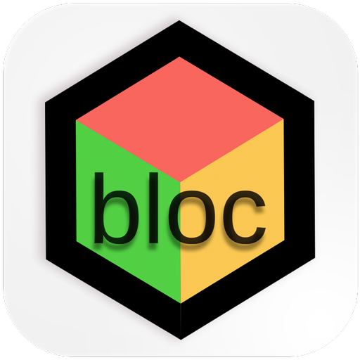
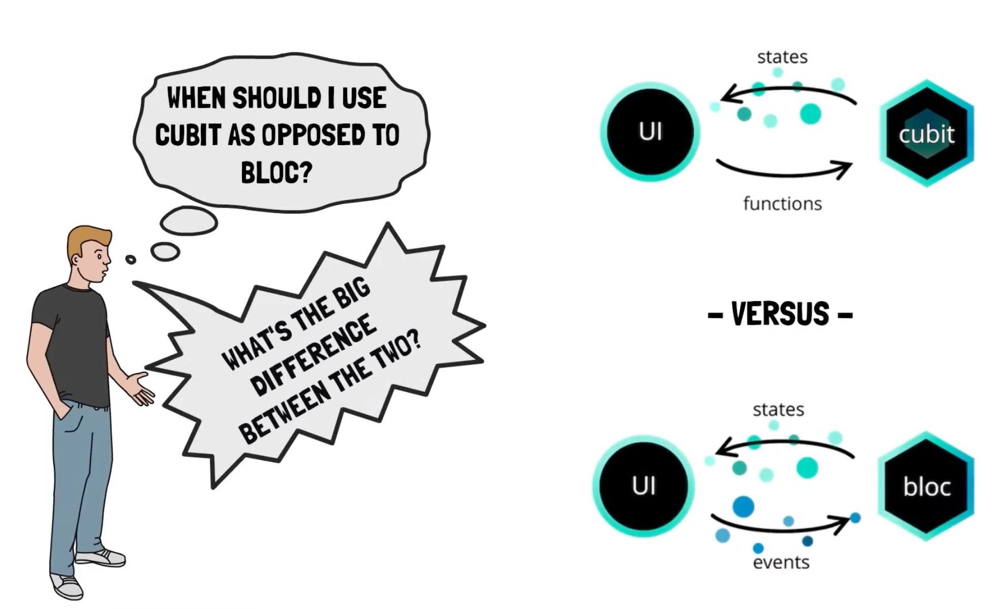
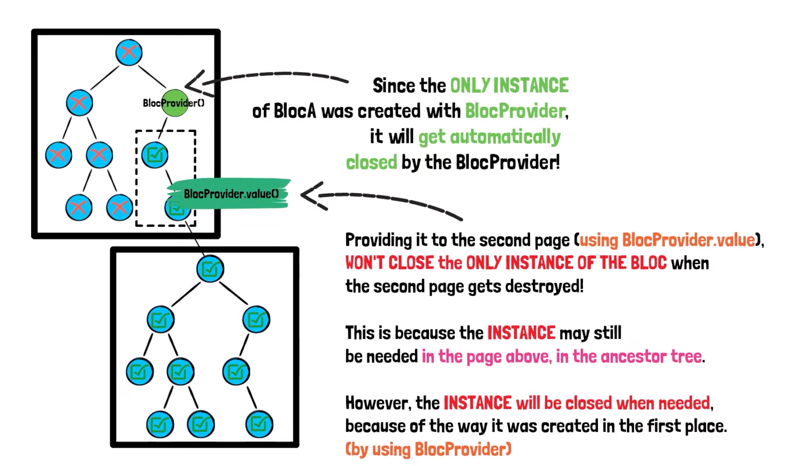
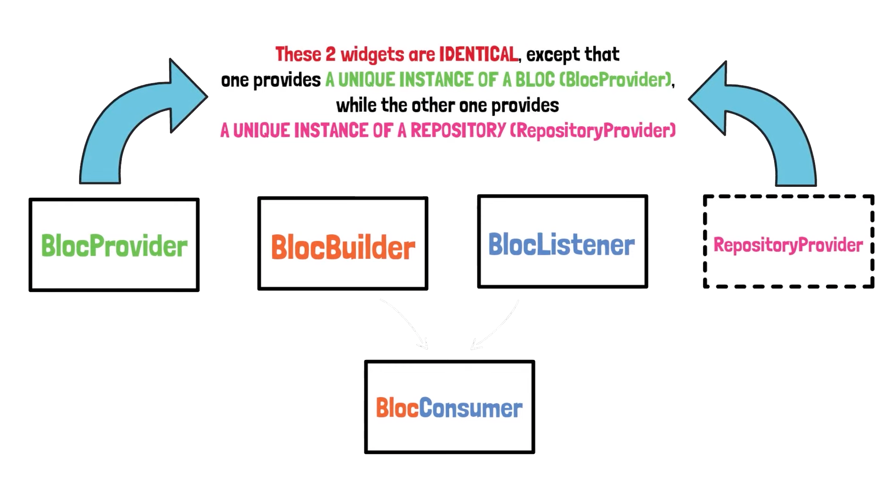
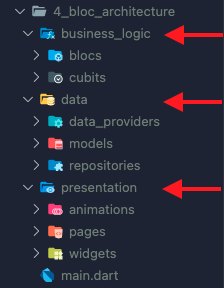
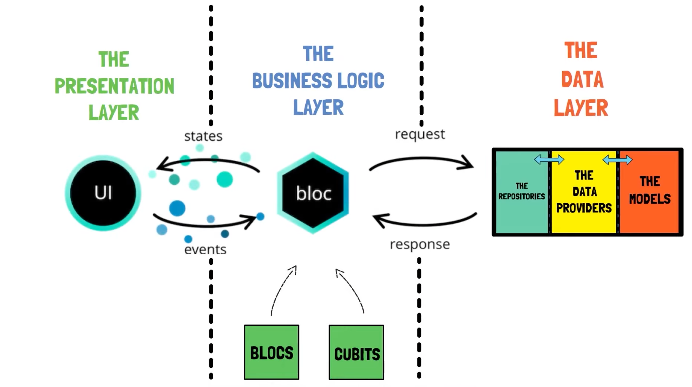
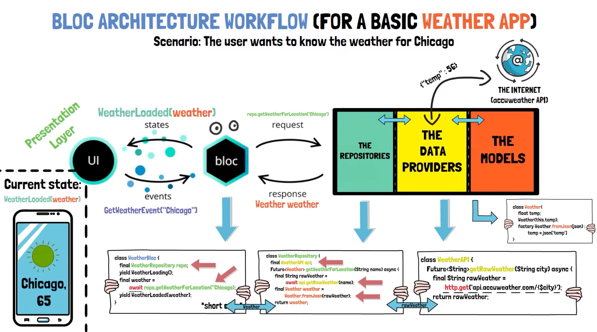

# BLoC Tutorial - [Udemy](https://www.udemy.com/course/bloc-from-zero-to-hero/)

</img>

The full documentation on BLoC package is available in [bloclibrary.dev](https://bloclibrary.dev/). This video tutorial is also available on [youtube](https://www.youtube.com/watch?v=THCkkQ-V1-8). If you want, then instead of buying the Udemy tutorial, you can follow the youtube tutorial.

Bloc was designed with three core values in mind:

```
1. Simple: Easy to understand & can be used by developers with
               varying skill levels.

2. Powerful: Help make amazing, complex applications by composing
               them of smaller components.

3. Testable: Easily test every aspect of an application so that we
               can iterate with confidence.
```

**Overall, Bloc attempts to make state changes predictable by regulating when a state change can occur and enforcing a single way to change state throughout an entire application.**

## BLoC Core Concept

</img>

**1. Stream:** <br>
It is the foundation of BLoC. The stream is a river , which transport some data, on a boat, from the sender to the receiver. The transported data is asynchronous.<br>

**2. Cubit:** <br>
A cubit is the minimal version of a BLoC. BLoC actually extends cubit.

**3. Bloc:** <br>
BLoC is the big brain of the project. Where as cubit is used to optimize the functionality of the project.

\*\*Note: Start with a cubit. If you see the necessity, then modify your cubit into BLoC.

## Flutter BLoC Concept

</img>

<p>
Some vital Flutter concepts to get going (widget, widget tree).

1. BlocProvider + CounterApp implementation.
2. BlocBuilder + CounterApp implementation.
3. BlocListener + CounterApp implementation.
4. BlocConsumer + CounterApp implementation.
5. RepositoryProvider
6. MultiBlocListener, MultiBlocProvider, MultiRepositoryProvider
</p>
<p>
`RepositoryProvider is a class. Which has the main function which makes flutter communicate with outer data layer i.e. internet, APIs, databases, etc`
</p>
</img>
<p align="center">BlocBuilder & BlocListener can be combined together to from BlocConsumer</p>

## BLoC Architecture

</img>

<p>
Like every application, BLoC also follows a specific file pattern. The "Business logic" layer is separated from the "Presentation" and from the "Data" layers. 
</p>
</img>
<p align="center">Complete BLoC architecture</p><br>

</img>

<p align="center">Weather app architecture</p>
