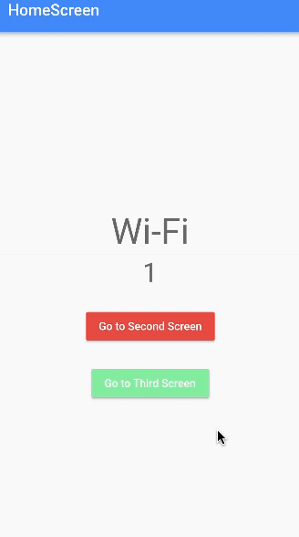

&nbsp;&nbsp;
&nbsp;&nbsp;
<a href="https://choosealicense.com/licenses/mit/" target="_blank"></a>&nbsp;&nbsp;
&nbsp;&nbsp;


# BLoC Tutorial - [Udemy](https://www.udemy.com/course/bloc-from-zero-to-hero/)

</img>

This tutorial video is also available on [youtube](https://www.youtube.com/watch?v=THCkkQ-V1-8). If you want, then instead of buying the Udemy tutorial, you can follow the youtube tutorial. The full documentation on BLoC package is available in [bloclibrary.dev](https://bloclibrary.dev/).

Bloc was designed with three core values in mind:

```
1. Simple: Easy to understand & can be used by developers with
               varying skill levels.

2. Powerful: Help make amazing, complex applications by composing
               them of smaller components.

3. Testable: Easily test every aspect of an application so that we
               can iterate with confidence.
```

**Overall, Bloc attempts to make state changes predictable by regulating when a state change can occur and enforcing a single way to change state throughout an entire application.**

## BLoC Core Concept

</img>

**1. Stream:** <br>
It is the foundation of BLoC. The stream is a river , which transport some data, on a boat, from the sender to the receiver. The transported data is asynchronous.<br>

**2. Cubit:** <br>
A cubit is the minimal version of a BLoC. BLoC actually extends cubit.

**3. Bloc:** <br>
BLoC is the big brain of the project. Where as cubit is used to optimize the functionality of the project.

\*\*Note: Start with a cubit. If you see the necessity, then modify your cubit into BLoC.

## Flutter BLoC Concept

</img>

<p>
Some vital Flutter concepts to get going (widget, widget tree).

1. BlocProvider + CounterApp implementation.
2. BlocBuilder + CounterApp implementation.
3. BlocListener + CounterApp implementation.
4. BlocConsumer + CounterApp implementation.
5. RepositoryProvider
6. MultiBlocListener, MultiBlocProvider, MultiRepositoryProvider
</p>

**`RepositoryProvider` is a class. Which has the main function which makes flutter communicate with outer data layer i.e. internet, APIs, databases, etc.**

<table align="center" style="margin: 0px auto;">
  <tr>
    <td></img></td>
  </tr>
</table>

<p align="center">BlocBuilder & BlocListener can be combined together to from BlocConsumer</p>

## BLoC Architecture

<table align="center" style="margin: 0px auto;">
  <tr>
    <td></img></td>
  </tr>
</table>

</img>

BLoC follows a specific folder pattern. The "Business logic" layer is separated from the "Presentation" layer and from the "Data" layer.<br>

&nbsp;1. First design the models. A model is a `blueprint` of the data an application will work with.<br><br>
&nbsp;2. Next the data providers. The data providers' responsibility is to provide raw data to it's successor, which is the `repositories`. It is actually an `API` for our own application. <br><br>
&nbsp;3. The repository is mainly a `wrapper` around one, or more data providers. Repositories are also `classes`, which contains dependencies of the respective data providers.

## BLoC Testing

A test is defined by how we programmatically tell flutter to `double check` the output given by a feature is equal to the expected response we planned on receiving. Packages needed for testing a BLoC:

```yaml
dependencies:
  flutter:
    sdk: flutter
  # Helpful for testing equal instances
  equatable: ^2.0.3
  # For testing
  bloc_test: ^9.0.3
```

In Dart language, **TWO INSTANCES** of the same exact class are not equal even though they are basically identical. This is because, these two instances are stored in different part of the memory, and dart compares their location in memories instead of their value.<br>
Hence, we need `equatable` package to solve this problem. Equatable package simply `@overrides` the equal operator.

```dart
    CounterState stateA = CounterState(counterValue:0);
    CounterState stateB = CounterState(counterValue:0);

                statA != stateB
```

## BLoC Access

```
  BlocProvider() vs BlocProvider.value()

  - BlocProvider() -> Necessary when transferring state to the HomeScreen()
  - BlocProvider.value() -> Necessary for transferring state to the SecondScreen() & also
                            to the ThirdScreen()
```

- **Local Access:** Providing an instance of bloc/cubit to a `SINGLE SCREEN` is called local access. Example: wrapping the `HomeScreen()` with BlocProvider().

- **Route Access:** Providing an instance of bloc/cubit to `MULTIPLE SCREEN` is called route access. Example: wrapping the `SecondScreen()` & `ThirdScreen()` with BlocProvider.value().

- **Global Access:** Providing am instance of bloc/cubit to `EVERY SCREEN` to your application. Example: wrapping the `MaterialApp()` with `BlocProvider()` or `MultiBlocProvider()`.

Three types of routing option in Flutter:

1. Anonymous routing: Navigation WITHOUT a RouteName.
2. Named routing: Navigation WITH a RouteName. Recommended for small & medium size project.
3. Generated routing: Separating the route information into a separate file. Recommended for large size project.

## BLoC Communication

<table align="center" style="margin: 0px auto;">
  <tr>
    <td></img></td>
  </tr>
</table>

A Bloc/Cubit can communicate with each other using `StreamSubscription` or `BlocListener`. Both methods are equally good with their specific PROS/CONS<br>

PROS of `StreamSubscription`:

- organized, structured, easy to read & maintain.
- will help us practice stream skills.

CONS of `StreamSubscription`:

- it may get cluttered really fast on huge apps
- not closing streamSubscription => huge memory leaks

<br>----------------------------------------------- xxxx -----------------------------------------------<br>

`BlocListener` is a widget, hence it should be inside the widget tree. This just notifies the bloc/cubit. It tells the bloc/cubit what to do, not how to do it.

PROS of `BlocListener`:

- It takes care internally of all STREAMSubscriptions
- No need to take care of stream/memory leaks anymore

CONS of `BlocListener`:

- The UI may get cluttered & hard to read with multiple BlocListener

## App Screenshots

<table align="center" style="margin: 0px auto;">
  <tr>
    <th>Folder No.</th>
    <th>Name of the App</th>
    <th>Logic Files</th>
    <th>Screenshots</th>
  </tr>
  <tr>
    <td align="center">3</td>
    <td><a href="lib/3_flutter_bloc_concept/main.dart">Counter Using Cubit</a></td>
    <td>
      <a href="lib/3_flutter_bloc_concept/cubit/counter_cubit.dart">counter_cubit.dart</a><br>
      <a href="lib/3_flutter_bloc_concept/cubit/counter_state.dart">counter_state.dart</a>
      </td>
    <td></img></td>
  </tr>
  <tr>
    <td align="center">5</td>
    <td><a href="lib/5_bloc_testing/main.dart">BLoC Testing</a></td>
    <td>
      <a href="lib/5_bloc_testing/cubit/counter_cubit.dart">counter_cubit.dart</a><br>
      <a href="lib/5_bloc_testing/cubit/counter_state.dart">counter_state.dart</a>
      </td>
    <td></img></td>
  </tr>
  <tr>
    <td align="center">6</td>
    <td><a href="lib/6_bloc_access_n_routing/main.dart">BLoC Access & Route</a></td>
    <td>
      <a href="lib/6_bloc_access_n_routing/logic/cubit/counter_cubit.dart">counter_cubit.dart</a><br>
      <a href="lib/6_bloc_access_n_routing/logic/cubit/counter_state.dart">counter_state.dart</a>
      </td>
    <td></img></td>
  </tr>
  <tr>
    <td align="center">7.0</td>
    <td align="center"><a href="lib/7_0_bloc_communication/main.dart">BLoC Communication<br>using<br>StreamSubscription</a></td>
    <td>
      <a href="lib/7_0_bloc_communication/logic/cubit/counter_cubit.dart">counter_cubit.dart</a><br>
      <a href="lib/7_0_bloc_communication/logic/cubit/counter_state.dart">counter_state.dart</a><br>
      <a href="lib/7_0_bloc_communication/logic/cubit/internet_cubit.dart">internet_cubit.dart</a><br>
      <a href="lib/7_0_bloc_communication/logic/cubit/internet_state.dart">internet_state.dart</a>
      </td>
    <td></img></td>
  </tr>
  <tr>
    <td align="center">7.1</td>
    <td align="center"><a href="lib/7_1_bloc_communication/main.dart">BLoC Communication<br>using<br>BlocListener</a></td>
    <td>
      <a href="lib/7_1_bloc_communication/logic/cubit/counter_cubit.dart">counter_cubit.dart</a><br>
      <a href="lib/7_1_bloc_communication/logic/cubit/counter_state.dart">counter_state.dart</a><br>
      <a href="lib/7_1_bloc_communication/logic/cubit/internet_cubit.dart">internet_cubit.dart</a><br>
      <a href="lib/7_1_bloc_communication/logic/cubit/internet_state.dart">internet_state.dart</a>
      </td>
    <td></img></td>
  </tr>
</table>
